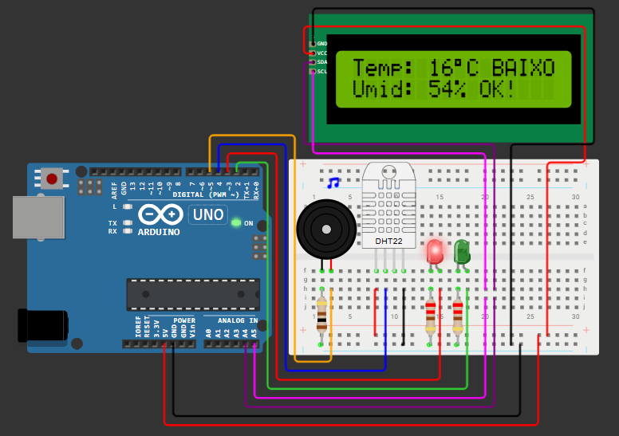
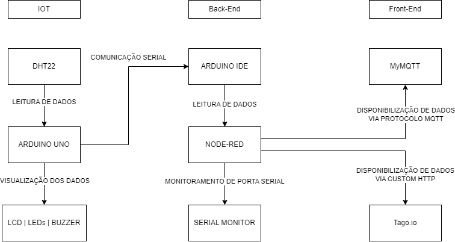
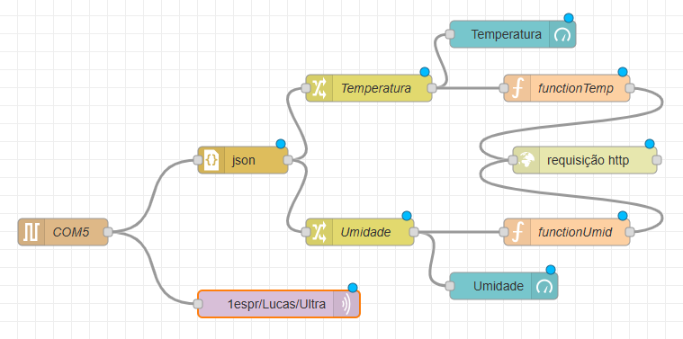
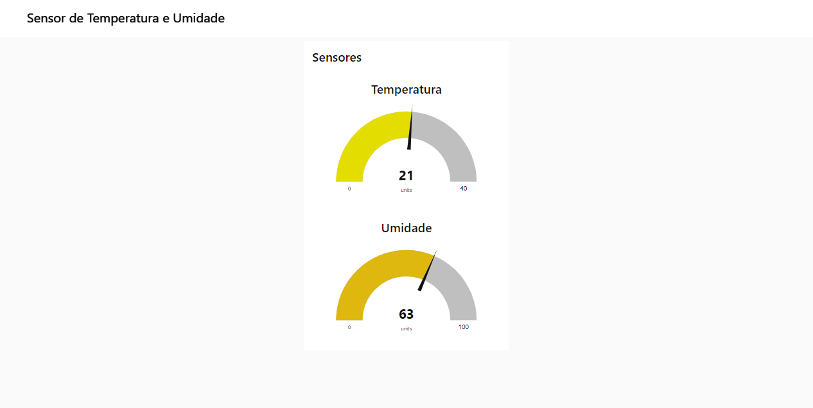
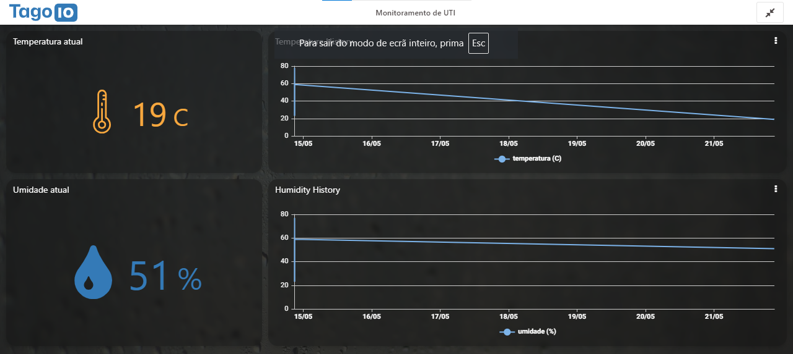
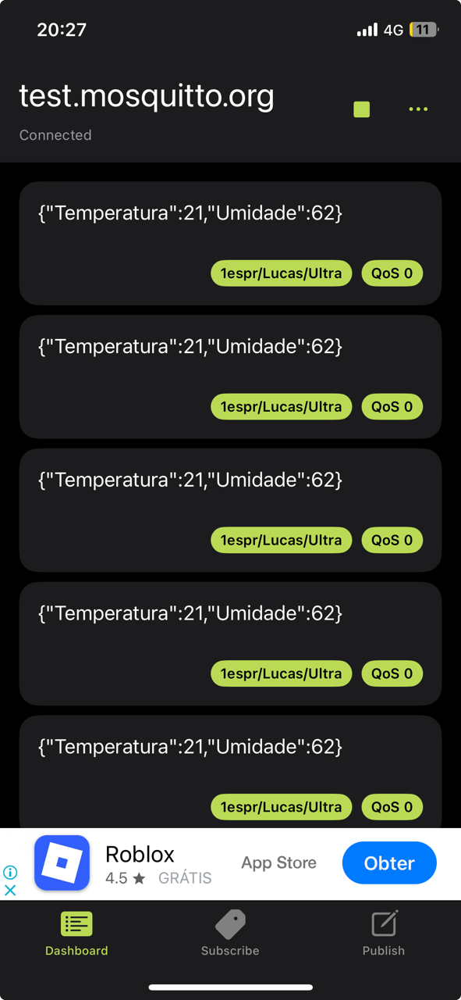

# Monitoramento de Temperatura e Umidade para UTIs
---
## 📝 Descrição do Projeto

Este projeto consiste em um sistema de monitoramento inteligente de temperatura e umidade para Unidades de Terapia Intensiva (UTIs) e centros cirúrgicos, utilizando a plataforma Arduino.

Ambientes críticos, como UTIs, exigem um rigoroso controle ambiental para garantir a segurança e conforto dos pacientes e a qualidade do atendimento. Automatizar o monitoramento desses parâmetros contribui para detectar rapidamente desvios, reduzir a sobrecarga da equipe de manutenção e prevenir falhas que possam impactar a saúde dos pacientes.

---
## 🎯 Objetivos

- Realizar o monitoramento contínuo de temperatura e umidade.
- Emitir alertas sonoros e visuais quando os parâmetros saírem das faixas ideais.
- Integrar o Arduino com plataformas de automação como Node-RED para facilitar a análise e gestão dos dados.
- Enviar dados ambientais para consumo externo via protocolo MQTT e HTTP.

---
## 🔧 Especificações Técnicas

- **Microcontrolador:** Arduino Uno R3
- **Sensor:** DHT22 (temperatura e umidade)
- **Interface de Visualização:** Display LCD 20x4 com comunicação I2C
- **Alerta Sonoro:** Buzzer ativo 5V
- **Alertas Visuais:**  
  - LED Vermelho: Indica estado de alerta (temperatura ou umidade fora dos limites).
  - LED Verde: Indica estado normal (temperatura e umidade dentro dos limites).
- **Comunicação Serial:** Transmissão de dados para o Node-RED via Arduino IDE
- **Comunicação via Broker MQTT:** Disponibilização dos dados para consumo por aplicações externas via protocolo MQTT
- **Comunicação via HTTP:** Disponibilização dos dados para consumo por aplicações externas via protocolo HTTP

---
## 💡 Protótipo (Wokwi)

- Link do projeto: https://wokwi.com/projects/433347937363803137 <br>
 <br>
- Assita o vídeo da simulação: <br>
[](https://www.youtube.com/watch?v=r5T-LJzRAXM)
- https://www.youtube.com/watch?v=r5T-LJzRAXM
---
## 📈 Diagrama do Sistema



---
## 📋 Descrição Detalhada do Diagrama

- **Camada IoT:** Responsável pela coleta de dados em tempo real (sensor DHT22) e pelas respostas locais imediatas (alerta sonoro e visual no buzzer e LCD).  
- **Camada Back-End:** 
  - O Arduino IDE é responsável por fornecer o código ao circuito Arduino e disponibilizar as informações na porta serial.
  - O Node-RED captura os dados transmitidos via serial e os disponibiliza para consulta via MQTT.
- **Camada Front-End:** 
  - Qualquer cliente MQTT, como o aplicativo **MyMQTT**, pode se conectar ao sistema para visualizar em tempo real as leituras de temperatura e umidade do ambiente.
  - Usando a plataforma Tago.io, você pode consumir os dados enviados via node-red e disponibilizá-los para uso em dashboards ou outros sistemas.
---
## 🔗 Node-Red

- Configuração dos flows: <br>

- Dashboard Node-Red: <br>


---
## 📡 Tago.io

- Usando a plataforma tago.io, podemos realizar a leitura dos dados usando um protocolo custom http <br>


---
---
## 📡 MQTT

- Usando o app MyMQTT, podemos realizar a leitura dos dados se inscrevendo no tópico: 1espr/Lucas/Ultra <br>


---
## 📜 Código Fonte do Projeto

```cpp
// Bibiliotecas
#include<ArduinoJson.h>
#include<DHT.h>
#include<LiquidCrystal_I2C.h>
// Pinos
#define DHTPIN 4
#define DHTTYPE 22
#define ledR 3
#define ledG 2
#define buzzerPin 5
// Variáveis Globais
DHT dht(DHTPIN, DHTTYPE);
LiquidCrystal_I2C lcd(0x27, 16, 2);
const int MAX_TEMP = 25;
const int MIN_TEMP = 20;
const int MAX_UMID = 65;
const int MIN_UMID = 40;
int temp = 0;
int umid = 0;
bool tempAlert = false;
bool umidAlert = false;
 
 
void checkSensor() {
  temp = dht.readTemperature();
  umid = dht.readHumidity();
  StaticJsonDocument<100>json;
  json["Temperatura"] = temp;
  json["Umidade"] = umid;
  serializeJson(json, Serial);
  Serial.println();
}
 
void setup() {
  Serial.begin(9600);
  Serial.println("Serial aberta!\n");
  dht.begin();
  pinMode(ledR, OUTPUT);
  pinMode(ledG, OUTPUT);
  pinMode(buzzerPin, OUTPUT);
  lcd.init();
  lcd.backlight();
}
 
void loop() {
  lcd.clear();
 
  //Temperatura
  lcd.setCursor(0, 0);
  lcd.print("Temp: ");
  lcd.print(temp);
  lcd.print((char)223);  // Símbolo de grau
  lcd.print("C");
  if (temp > MAX_TEMP) {
    lcd.print(" ALTO!");
    tempAlert = true;
  } else if (temp < MIN_TEMP) {
    lcd.print(" BAIXO!");
    tempAlert = true;
  } else {
    lcd.print(" OK!");
    tempAlert = false;
  }
 
  //Umidade
  lcd.setCursor(0, 1);
  lcd.print("Umid: ");
  lcd.print(umid, 1);
  lcd.print("%");
  if (umid > MAX_UMID) {
    lcd.print(" ALTO!");
    umidAlert = true;
  } else if (umid < MIN_UMID) {
    lcd.print(" BAIXO!");
    umidAlert = true;
  } else {
    lcd.print(" OK!");
    umidAlert = false;
  }
 
  //Alertas
  if (tempAlert == true || umidAlert == true) {
    for (int a = 0; a < 2; a++) {
      for (int b = 0; b < 2; b++) {
        tone(buzzerPin, 1000);
        delay(150);
        noTone(buzzerPin);
        delay(150);
      }
      digitalWrite(ledG, LOW);
      digitalWrite(ledR, HIGH);
      delay(1500);
    }
  } else {
    digitalWrite(ledR, LOW);
    digitalWrite(ledG, HIGH);
    delay(3600);
  }
 
  checkSensor();
  delay(1500);
}
```

---
## 👨‍💻 Integrantes do Projeto

- **Enzo Galhardo** - RM561001
- **Kauan Diogo da Paz Silva** - RM560727
- **Leonardo Luiz Jardim Queijo** - RM559842
- **Lucas de Almeida Villar** - RM560005

